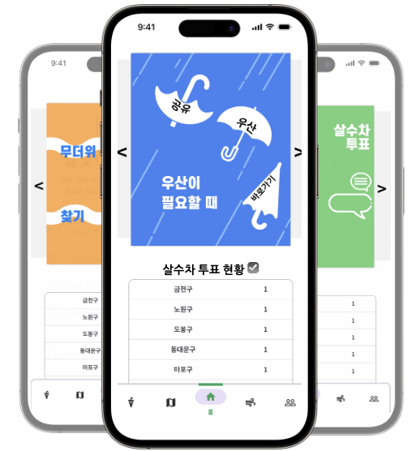
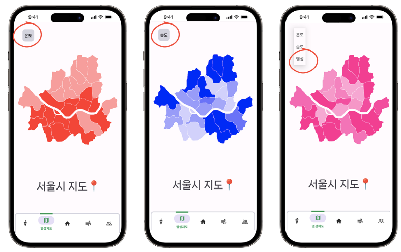
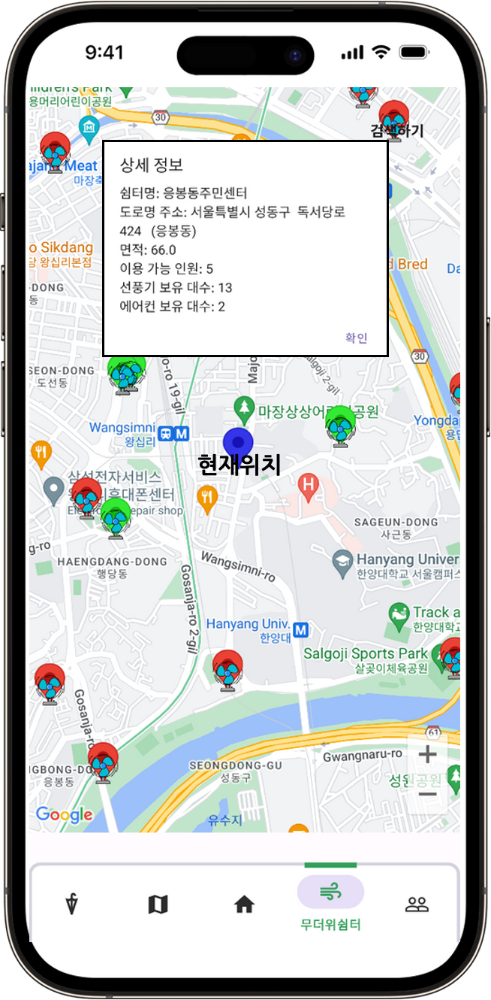
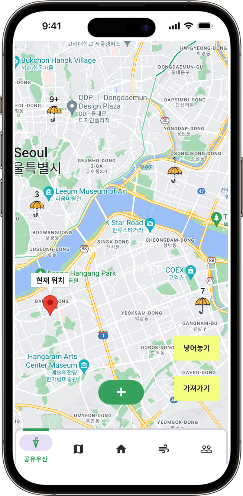
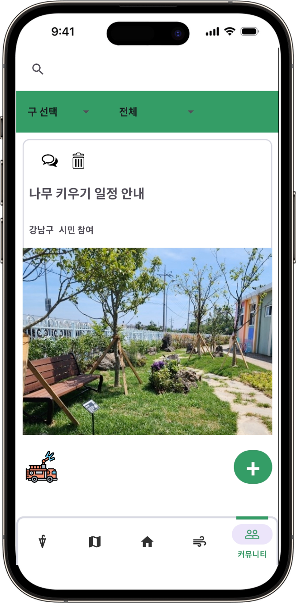
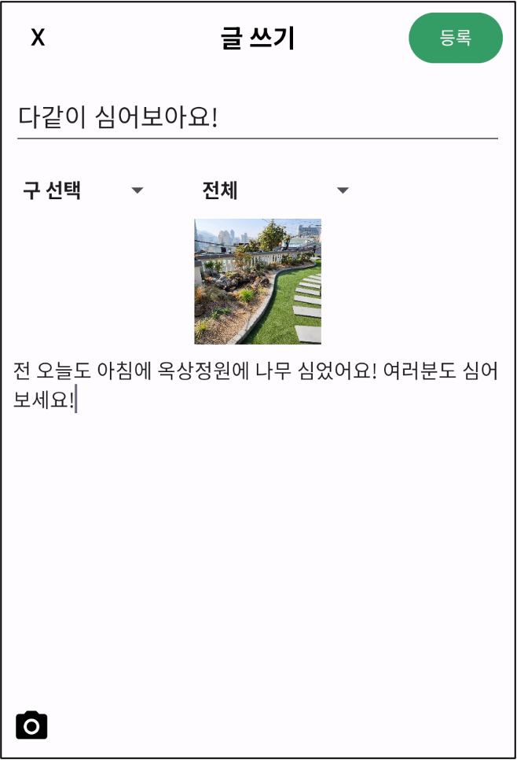
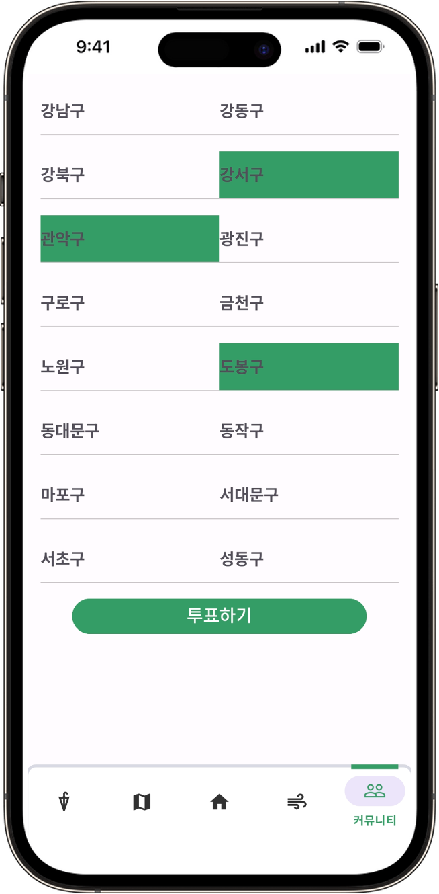

## ✅ mobile programming - 열섬현상 커뮤니티 어플 제작
도시열섬지도, 공유우산지도, 무더위쉼터지도, 사용자 커뮤니티 및 투표서비스가 제공되는 도시열섬 어플리케이션입니다.
<br><br>

<div align="center">
  
</div>

---

### 😀 팀원 소개
| 이름   | 역할   | 프로젝트 내용                       |
|--------|--------|------------------------------------|
| 유주경 | 팀장   | 도시 열섬 현상을 지도로 표현       |
| 조성진 | 팀원   | 공유 우산 지도 프로그램 구현       |
| 김솔아 | 팀원   | 무더위 쉼터 지도 프로그램 구현     |
| 김지애 | 팀원   | 커뮤니티 프로그램 구현             |
| 김영아 | 팀원   | 살수차 투표 프로그램 구현           |

### ⏰ Develop Period
---
- November 2023 ~ December 2023
<br>

### 🛠️ Development Environment
---
- lang: Java 17
- IDE: Android Studio
- Android compileSdk 34
- Android tartgetSdk 34
- emulator: Pixel 7 Pro API 34
- external library : VectorChildFinder
- database: MySQL, SQLlite
<br>

### 🌳 Structure Tree
---

```
├── README.md
├── __MACOSX
│   └── final
├── app
│   ├── build
│   ├── build.gradle
│   ├── proguard-rules.pro
│   └── src
├── build.gradle
├── gradle
│   └── wrapper
├── gradle.properties
├── gradlew
├── gradlew.bat
├── local.properties
├── settings.gradle
└── vectorchildfinder
    ├── build
    ├── build.gradle
    ├── proguard-rules.pro
    └── src
```


### 🧭 Setting
---
- 해당 프로젝트 파일을 다운로드하고 API 키를 설정하는 단계를 거쳐야 실행 가능합니다.
- 맵(지도)를 어플리케이션에 띄우기 위해 **google cloud console** 에서 프로젝트 및 API 키를 발급 받습니다.
- **서울시 열린 데이터 광장**에서 openAPI를 사용하여 필요한 데이터를 받아오기 위해 API 키를 발급 받습니다. 
- AndroidManifest.xml 파일에 다음과 같은 코드를 작성합니다.
```java
    <uses-permission android:name="android.permission.INTERNET" />
    <uses-permission android:name="android.permission.ACCESS_FINE_LOCATION" />
    <application>
        <!-- ... -->
        <meta-data
            android:name="com.google.android.geo.API_KEY"
            android:value="MY_API_KEY_HERE" />
    </application> 
```
- HeatShelterAPI.java 클래스에 key 변수로 서울시 api키를 적어 넣습니다.
<br>

### 📌 Main Function
---
#### **도시열섬지도**
<div align="center">
  
</div>
<br>

- SVG(Scalable Vector Graphics): 각 서울시 행정구 path 지정
- Spinner 를 사용하여 “온도", “습도", “열섬" 지도 표현
- 08.14 ~ 08.20 일 데이터 CSV  데이터 사용!
- 열섬 정의 기준은 평균 온도/습도 + 각 자치구 유동인구 고려
- S-Dot  유동인구 & 도시데이터 CSV 사용 
<br>

#### **무더위쉼터지도**
<div align="center">
  
</div>
<br>

- 열섬피해를 막기 위해 무더위 쉼터를 사용자에게 정보 제공
- 현재 사용자 위치 기준 무더위 쉼터를 Google Maps 에 표시(가장 가까운 쉼터 5곳을 초록색으로 표시)
- 쉼터 아이콘 터치시 상세 주소 및 상황 제공
- 구 별 무더위쉼터 **검색** 기능 제공
- 서울시 무더위 쉼터 open API 사용 및 데이터 parse 함수를 이용하여 전처리
<br>

#### **공유우산지도 (본인 업무 담당)**
<div align="center">
  
</div><br>

- 열섬으로 인한 불규칙적인 날씨, 뜨거운 햇빛으로부터 피해예방
- 사용자 위치 **(서울 시로 가정하였기 때문에 임의로 설정)** 기준 우산통 배치 및 우산 개수 수정 가능
    - 우산은 최대 2개를 가져갈 수 있음
    - 현재 위치에 우산통이 존재하면 새로운 우산통을 놓지 못하게 설정
    - 우산 모양 아이콘을 누르게 되면 우산 추가, 제거 버튼이 활성화됨
    - 중앙에 + 버튼을 누르게 되면 이름 설정 후 우산통을 둘 수 있음 
- 서비스 사용자는 아이콘을 통하여 손쉽게 공유 우산 조회 가능
- Google Maps API를 사용하여 지도와 마커를 다룸
  
<br>

#### **커뮤니티**
<div align="center">
  
  
</div>
<br>

- 해당 지역구의 카테고리별로 게시물 **작성** 가능, 게시물 **삭제** 가능
- 카테고리 및 지역구별 **검색** 가능
- 댓글 기능 구현
- DB연동, SQL 사용
<br>

#### **살수차투표**
<div align="center">
  
</div>
<br>

- 해당 지역구 사람들의 투표로 살수차 배치 고려
- 메인 화면을 통하여 투표된 지역구 조회 가능
- DB 연동, SQL 사용


